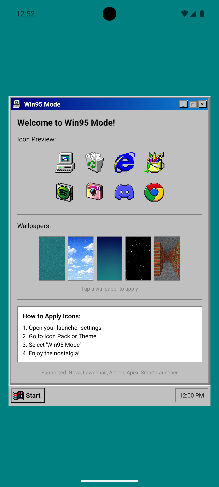

# Win95 Mode

A nostalgic Windows 95-style icon pack and wallpaper manager for Android. Transform your phone into a retro desktop experience.

## Download

[**Download latest APK**](../../releases/latest)

## Screenshots

  
  

## Features

- 40+ app icons styled like classic Windows 95
- Authentic Win95 UI elements (beveled borders, 3D buttons)
- Classic wallpapers (teal, clouds, setup, stars, matrix)
- One-tap wallpaper application
- Works with all major Android launchers

## Supported Launchers

- Nova Launcher
- Lawnchair
- Action Launcher
- Apex Launcher
- Smart Launcher
- And more...

## Installation

1. Download and install the APK from [Releases](../../releases/latest)
2. Open your launcher settings
3. Navigate to Icon Pack or Theme
4. Select "Win95 Mode"
5. Enjoy the nostalgia!

## Tech Stack

- **Language:** Kotlin
- **Platform:** Android (API 24 - Android 7.0+)
- **UI:** XML Layouts with custom drawable resources
- **Build System:** Gradle with Kotlin DSL
- **Architecture:** Single-activity app with intent filters for launcher integration
- **Icon Pack Protocol:** Supports ADW, Nova, Apex, Action, Lawnchair, and Smart Launcher icon pack formats via `appfilter.xml`
- **Min SDK:** 24 | **Target SDK:** 36
