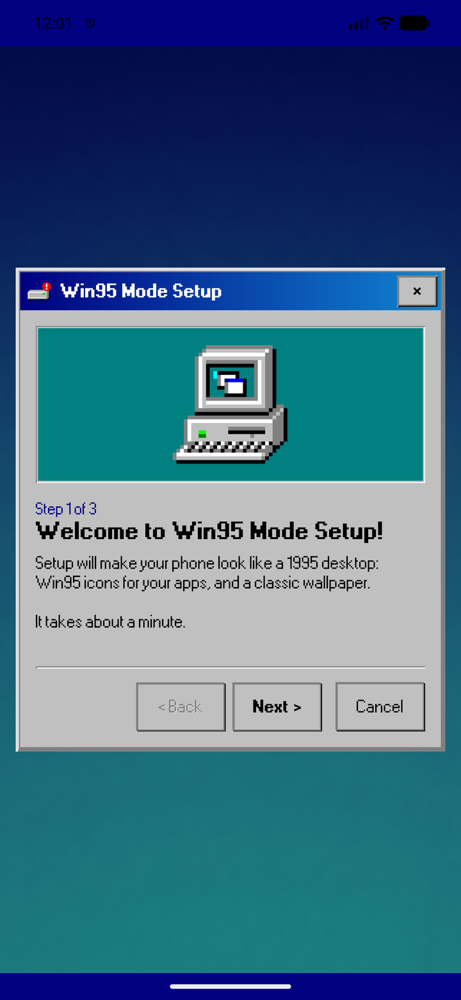
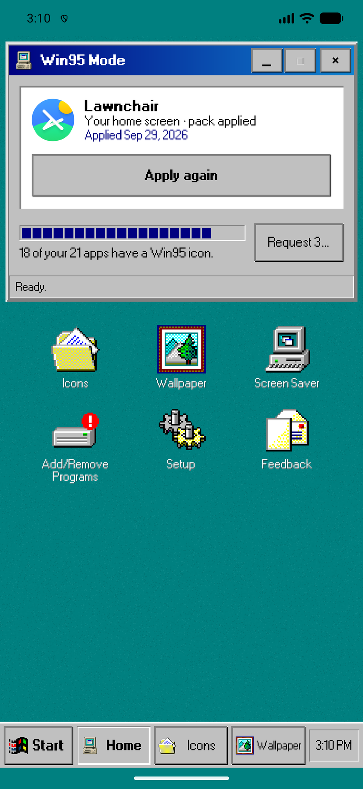
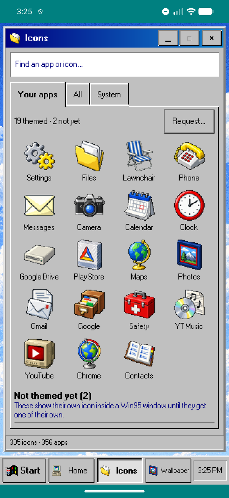
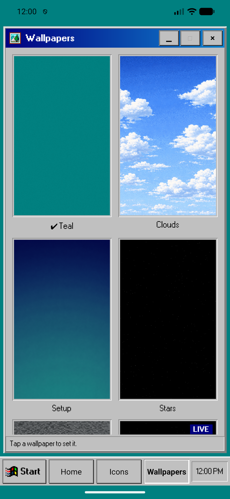

# Win95 Mode

A nostalgic Windows 95-style icon pack and wallpaper manager for Android. Transform your phone into a retro desktop experience.

## Download

[**Download latest APK**](../../releases/latest)

## Screenshots

<p align="center">
  
  
  
  
</p>

## What's New in v3

- Samsung, Xiaomi and OnePlus/Oppo support: system apps (dialer, camera, messages, gallery, clock, files and more) are finally themed on non-Pixel phones — the pack now themes 296 apps, up from about 45
- 202 new icons, one per app: Facebook, Messenger, WeChat, Outlook, Zoom, Teams, Docs, Excel, PowerPoint, Gemini, Claude, Deezer, SoundCloud, Disney+, Uber Eats, Glovo, Wallapop, Vinted, Zara, IKEA, Revolut, BBVA, CaixaBank, Airbnb, Ryanair, Minecraft, Clash of Clans, Steam and many more
- A redesigned app: a Windows 95 Setup wizard that finds a launcher that works, and a taskbar that switches between Home, Icons and Wallpapers
- Home shows whether your launcher can use the pack and how many of your apps are themed; Icons shows your own apps first
- Now in Spanish, with the pixel font's missing accented letters drawn in
- Starfield Screensaver live wallpaper: the classic flying-through-space simulation, forever
- Dynamic calendar icon that shows today's actual date (Nova, Lawnchair and friends)
- Request Icons: an Add/Remove Programs screen lists your unthemed apps and sends the request with one tap
- Wallpapers regenerated at real phone resolution — no more blurry pixel art
- Releases are now signed with a permanent key, so future updates install in place (this first one needs a one-time uninstall/reinstall — see the release notes)

## Features

- 250+ icons theming 290+ apps, one icon per app, styled like classic Windows 95
- Apps without a themed icon show inside a small Win95 program window, so the whole home screen stays coherent
- Authentic Win95 UI: Setup wizard, taskbar, Start menu, property-sheet tabs, message boxes, MS Sans Serif pixel font
- English and Spanish
- Classic wallpapers (teal, clouds, setup, stars, maze) for home and lock screen, plus the animated Starfield
- Works with all major Android launchers

## Supported Launchers

- Nova Launcher
- Lawnchair
- Action Launcher
- Apex Launcher
- Smart Launcher
- And more...

## Installation

1. Download and install the APK from [Releases](../../releases/latest)
2. Open Win95 Mode. Setup checks your launcher and walks you through applying the icons.

Stock Pixel and most Samsung launchers can't use icon packs; Setup offers a free
launcher (Lawnchair) and picks up where it left off once it's installed.

## Tech Stack

- **Language:** Kotlin
- **Platform:** Android (API 24 - Android 7.0+)
- **UI:** XML Layouts with custom drawable resources
- **Build System:** Gradle with Kotlin DSL
- **Architecture:** a main activity (taskbar with three windows) and a Setup activity, with intent filters for launcher integration
- **Icon Pack Protocol:** Supports ADW, Nova, Apex, Action, Lawnchair, and Smart Launcher icon pack formats via `appfilter.xml`
- **Min SDK:** 24 | **Target SDK:** 36

## Icon Tooling

Icon artwork is normalized with `scripts/win95ify.py` (requires Python 3 with Pillow):

```bash
python3 -m venv .venv && .venv/bin/pip install Pillow
.venv/bin/python scripts/win95ify.py win95ify <source-images> -o app/src/main/res/drawable-nodpi --strip-bg
```

It converts any source image to a true pixel grid with a reduced retro palette
on a 192x192 canvas. Run it with `--help` for all options.

## Credits

- MS Sans Serif pixel font: [FontStruct recreation by "lou"](https://fontstruct.com/fontstructions/show/1384746) (CC BY-SA 3.0), via [98.css](https://github.com/jdan/98.css)
- Classic system icons based on the Windows 95/98 originals
